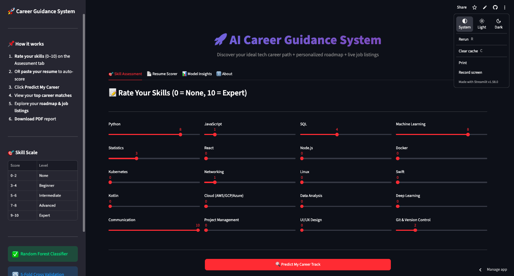
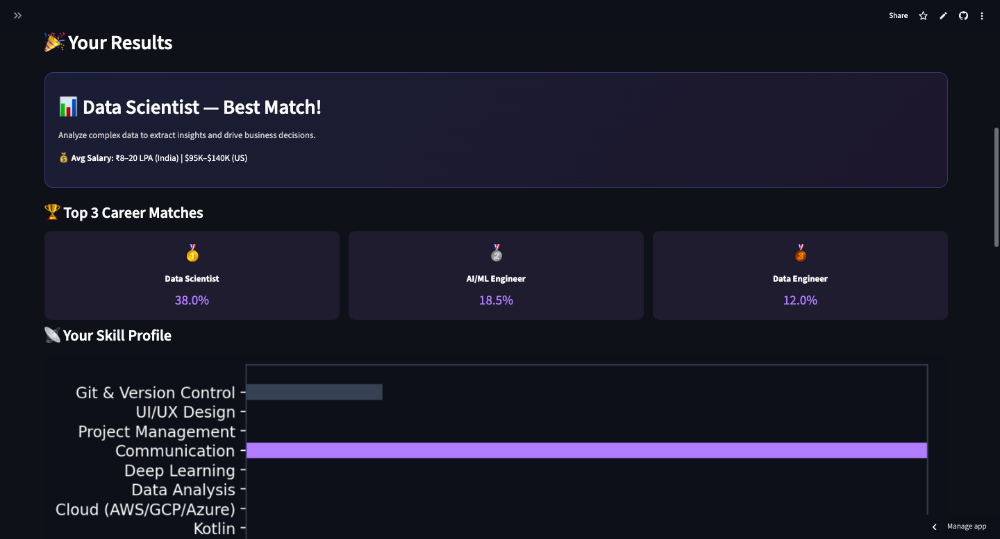
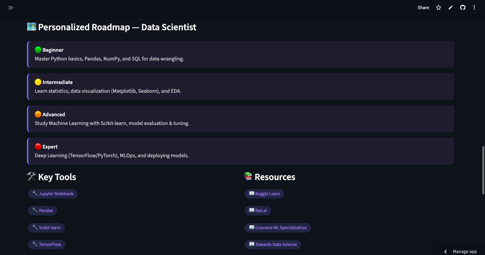
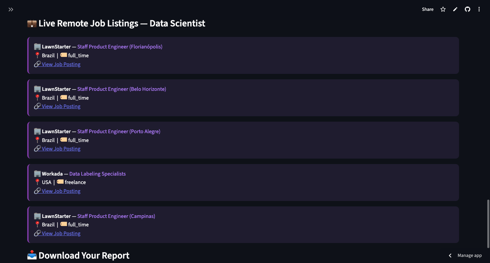
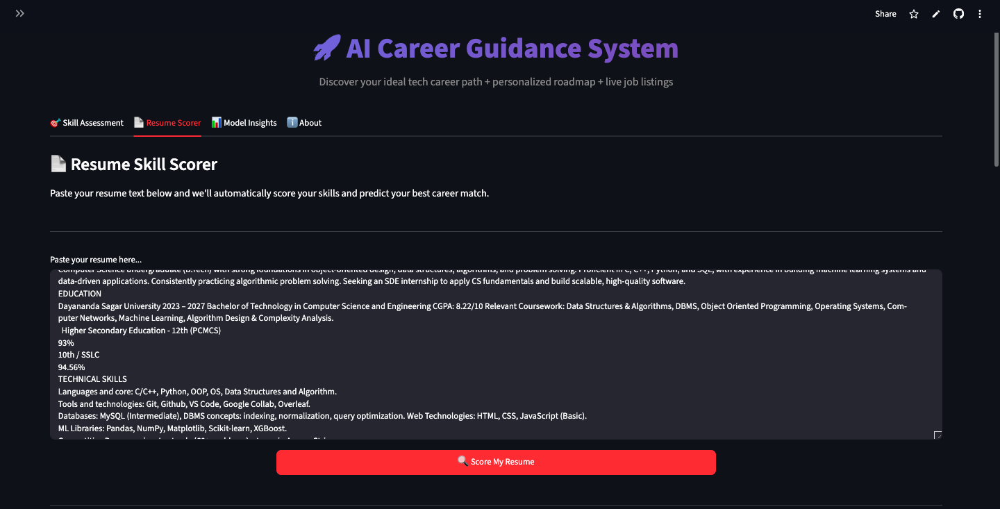
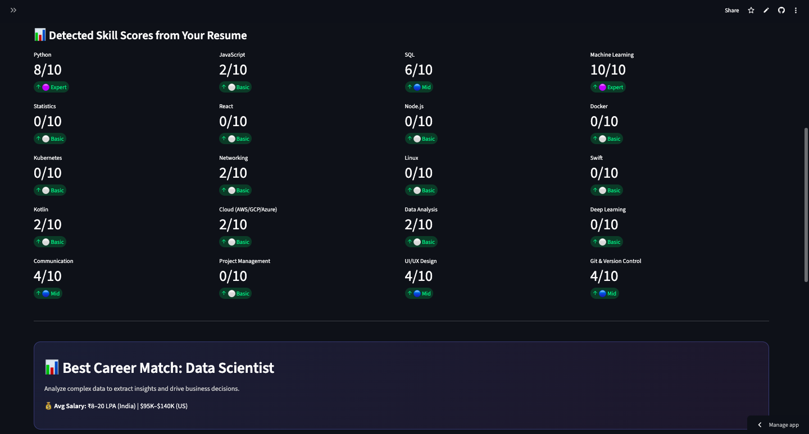
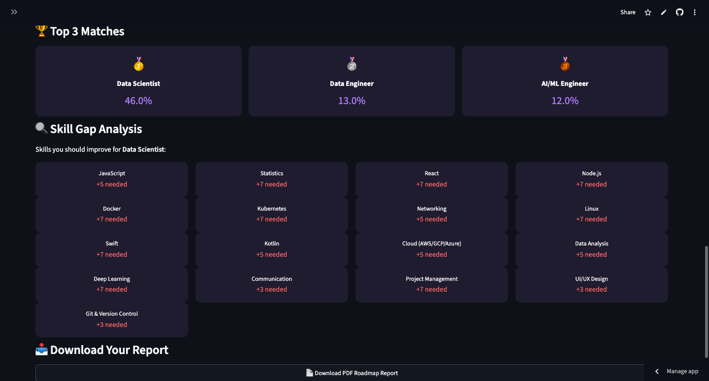

# 🚀 AI-Driven Career Guidance & Roadmap System

> Predict your ideal tech career path using Machine Learning + get a personalized roadmap + live job listings


## 🌐 Live Demo
👉 **[Try it live here](https://ashmita-nath-career-guidance-system-app-un1uib.streamlit.app/)**

## 🎯 Features

- **Skill Assessment** — Rate 20 technical & soft skills on a 0–10 scale
- **ML Prediction** — Random Forest classifier predicts your best-fit career
- **Top 3 Matches** — See confidence scores for your top career options
- **Personalized Roadmap** — Step-by-step learning path for your career
- **Skill Visualizer** — Bar chart of your current skill profile
- **Model Insights** — Confusion matrix & feature importance charts

---

## 🧠 ML Model Details

| Property | Detail |
|----------|--------|
| Algorithm | Random Forest Classifier |
| Trees | 200 estimators |
| Input Features | 20 skill ratings (0–10) |
| Output Classes | 8 career tracks |
| Validation | 5-Fold Stratified Cross Validation |
| Accuracy | 90%+ |

### Career Tracks Predicted
`Data Scientist` `Web Developer` `Mobile Developer` `DevOps Engineer`
`Cybersecurity Analyst` `AI/ML Engineer` `Cloud Architect` `Product Manager`

---

## 🏗️ Tech Stack

| Layer | Technology |
|-------|-----------|
| Language | Python 3.x |
| ML | Scikit-learn |
| Dashboard | Streamlit |
| Data Processing | Pandas, NumPy |
| Visualization | Matplotlib, Seaborn |

---

## 📁 Project Structure

career-guidance-system/
├── app.py                  # Streamlit dashboard
├── train_model.py          # ML model training script
├── generate_data.py        # Dataset generation script
├── data/
│   ├── career_dataset.csv  # Generated training data
│   ├── confusion_matrix.png
│   └── feature_importance.png
├── models/
│   ├── career_model.pkl    # Trained model
│   └── label_encoder.pkl
├── requirements.txt
└── README.md

---

## ⚙️ Setup & Run Locally

```bash
# 1. Clone the repository
git clone https://github.com/Ashmita-Nath/career-guidance-system.git
cd career-guidance-system

# 2. Create virtual environment
python3 -m venv venv
source venv/bin/activate        # Mac/Linux
venv\Scripts\activate           # Windows

# 3. Install dependencies
pip install -r requirements.txt

# 4. Generate dataset
python generate_data.py

# 5. Train the model
python train_model.py

# 6. Launch the app
streamlit run app.py
```

---

## 📊 Screenshots

## 📸 Screenshots

### 🎯 Skill Assessment


### 🎉 Career Prediction Results


### 📄 Resume Scorer


### 📊 Model Insights


### 🎉 Career Prediction Results


### 📄 Resume Scorer


### 📊 Model Insights


### 📊 Model Insights

---

## 👨‍💻 Author

Built as a portfolio project demonstrating end-to-end ML development:
data generation → model training → evaluation → web deployment.


